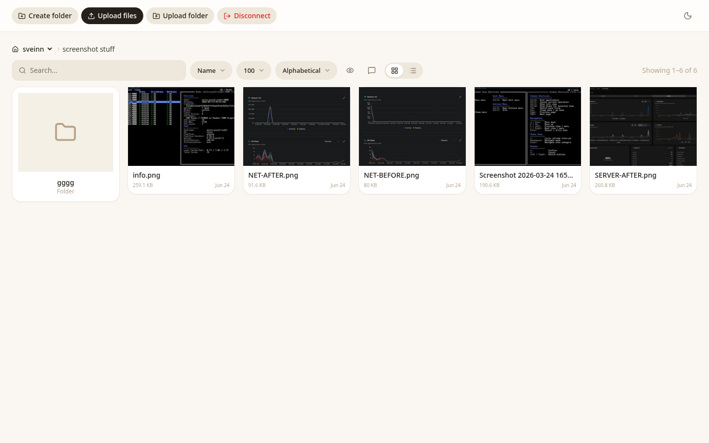
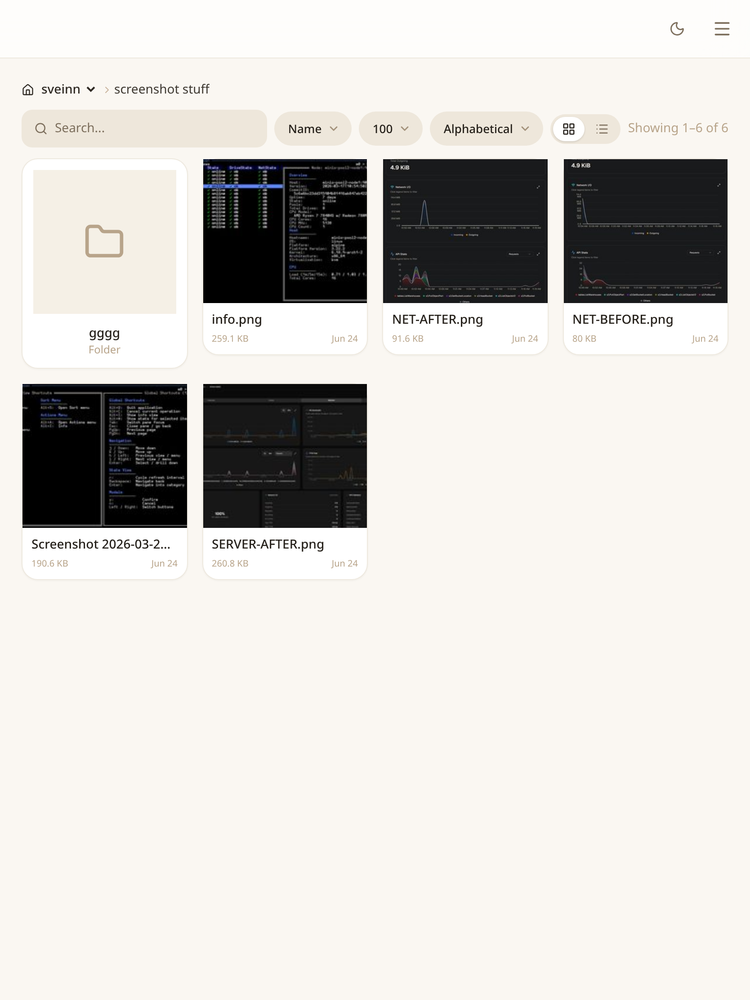
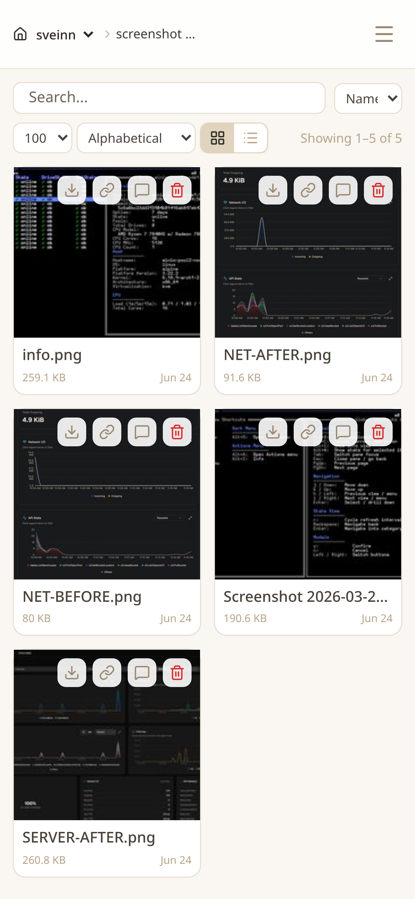

# Minstorage

## How to get minio enterprise for free
- go to the min.io website
- press "download"
- request a free license key

A simple, modern file browser for MinIO. One Go binary serves the React web app
and acts as a transparent S3 proxy to your MinIO server.

The browser never talks to MinIO directly. It speaks the S3 protocol to this Go
backend, which forwards every request to MinIO with the user's own signature
left intact (no re-signing). Because the browser only ever connects to the
backend's own origin, **MinIO needs no CORS configuration** and does not have to
be reachable from clients at all — only the backend needs to reach it.

## Screenshots

| Desktop | Tablet | Mobile |
| --- | --- | --- |
|  |  |  |

> Regenerate these with the helper in [`screenshots/`](screenshots/) — see its
> usage at the top of [`screenshots/capture.mjs`](screenshots/capture.mjs).

## Install (no build needed)

For non-developers: download the prebuilt binaries and run them. No Go or
Node.js required — just MinIO and the MinStorage release.

### 1. Download and start MinIO (3-drive local setup)

Download the MinIO server for your platform from [dl.min.io](https://dl.min.io):

```bash
# Linux (amd64)
wget https://dl.min.io/server/minio/release/linux-amd64/minio
chmod +x minio

# macOS (Apple Silicon): https://dl.min.io/server/minio/release/darwin-arm64/minio
# Windows (amd64):        https://dl.min.io/server/minio/release/windows-amd64/minio.exe
```

Create three local drive folders and start MinIO across them:

```bash
mkdir -p ~/minio-data/disk{1,2,3}

export MINIO_ROOT_USER=minioadmin
export MINIO_ROOT_PASSWORD=minioadmin
# Allow data folders on your system/root drive (needed for this local setup)
export MINIO_CI_CD=true

./minio server ~/minio-data/disk{1...3} \
  --address ":9000" \
  --console-address ":9001"
```

- MinIO's S3 API is now at `http://127.0.0.1:9000` (user `minioadmin`, password `minioadmin`).
- Spreading data across 3 drives turns on erasure coding, so the setup can
  survive one drive failing. Use more drives / nodes for real deployments.
- `MINIO_CI_CD=true` is required here because MinIO refuses to use drives that
  live on the root filesystem (a safety guard). Since `~/minio-data` is on your
  root drive, this flag disables that check. With dedicated drives/partitions
  you can drop it.
- Mind the brace styles: the shell needs `{1,2,3}` for `mkdir`, while MinIO
  expands its own `{1...3}` (three dots).

Open the MinIO Console at `http://127.0.0.1:9001` (same credentials) to create a
bucket for your files.

### 2. Download and run MinStorage

Grab the binary for your platform from the
[latest release](https://github.com/zveinn/minstorage/releases/latest):

| Platform | File |
| --- | --- |
| Linux (amd64) | `minstorage-linux-amd64` |
| Linux (arm64) | `minstorage-linux-arm64` |
| macOS (Intel) | `minstorage-darwin-amd64` |
| macOS (Apple Silicon) | `minstorage-darwin-arm64` |
| Windows (amd64) | `minstorage-windows-amd64.exe` |

```bash
# example: Linux amd64
chmod +x minstorage-linux-amd64
./minstorage-linux-amd64 \
  --address 0.0.0.0:7002 \
  --minio http://127.0.0.1:9000 \
  --user minioadmin \
  --pass minioadmin
```

Then open `http://localhost:7002` in your browser and log in with your MinIO
user and password (`minioadmin` / `minioadmin` above).

- `--minio` points at the MinIO S3 API from step 1; `--user` / `--pass` are the
  MinIO credentials.
- MinStorage proxies S3 traffic to MinIO, so only MinStorage needs to be
  reachable from your browser — MinIO does not need CORS or public access.
- On macOS, if the binary is blocked as unidentified, allow it with
  `xattr -d com.apple.quarantine ./minstorage-darwin-arm64`.

### 3. (Optional) Invite others with a signup link

You can hand someone a one-time link that lets them create their own MinIO user
(their own username + password) without sharing the admin credentials. Run the
`signup` subcommand with the address people will use to reach MinStorage:

```bash
./minstorage-linux-amd64 signup --signupHostPort localhost:7002
```

It prints a one-time URL, e.g.:

```
http://localhost:7002/signup/2b7c9f1e-...-e9
```

- Run it from the **same folder** as the running server — they share the token
  store (under `./previews`, or `PREVIEW_CACHE_DIR`), so the running server
  recognises the link you generated.
- The link is valid for **24 hours** and works **once**.
- The running MinStorage must have admin MinIO credentials (the `--user` /
  `--pass` from step 2), because it creates the new MinIO user on their behalf.
- Send the link to the person; they open it, pick a username and password, and
  can then log in to MinStorage with those.

## What you need

- Go 1.25 or newer
- Node.js 20 or newer
- A running MinIO server

## Build from source (for developers)

### 1. Build the web app

```bash
cd frontend
npm install
npm run build
```

This builds the web app and copies it into `backend/static`, so the Go server
can serve it.

### 2. Run the server

```bash
cd ../backend
go run main.go --minio http://127.0.0.1:9000

# full example
./backend --address 0.0.0.0:7002 --minio http://127.0.0.1:9000 --user minioadmin --pass minioadmin
```

`--minio` is the address the backend uses to reach MinIO. Its scheme controls
how the backend connects:

- `http://…`  → plain HTTP (default if no scheme is given)
- `https://…` → TLS

The backend then proxies the browser's S3 traffic to that address, so the
browser only ever connects back to the backend itself.

The server listens on `:8080` by default. To use a different address:

```bash
go run main.go --address 0.0.0.0:8080 --minio http://127.0.0.1:9000
go run main.go -a :9000 -m http://127.0.0.1:9001
```

> **MinIO CORS is not required.** Since the browser talks only to this backend,
> you do **not** need to configure `cors_allow_origin` on MinIO.

### 3. Log in

Open the server address in your browser (e.g. `http://localhost:8080`) and fill
in your MinIO credentials:

- **User**: your MinIO access key
- **Password**: your MinIO secret key (use the eye icon to reveal it)

Then click **Connect to MinIO**.

## What it can do

- Browse buckets and folders
- Upload files (button or drag and drop)
- Download files
- Delete files
- Image thumbnails and full-size previews
- Search the current view

## Command line options

| Flag                | Short | Description                                                  |
| ------------------- | ----- | ------------------------------------------------------------ |
| `--address`         | `-a`  | Address to listen on (default `:8080`)                       |
| `--minio`           | `-m`  | MinIO address the backend proxies to (scheme sets TLS)       |
| `--minio-tls`       |       | Force TLS to MinIO when `--minio` has no scheme (`=true`)    |
| `--user`            | `-u`  | MinIO access key for backend operations (e.g. previews)      |
| `--pass`            | `-p`  | MinIO secret key for backend operations                      |
| `--cert`            | `-c`  | Domain for automatic HTTPS (Let's Encrypt)                   |
| `--signupHostPort`  |       | Host:port used in generated signup links                     |

Whether the backend connects to MinIO over TLS is taken from the `--minio`
scheme (`https://` → on, `http://` → off). Only when no scheme is given does
`--minio-tls` apply — and it must be written as `--minio-tls=true` (the bare
`--minio-tls true` form is ignored by Go's flag parser).

You can also use environment variables: `ADDRESS`, `PORT`, `MINIO`, `MINIO_USER`,
`MINIO_PASS`, `MINIO_TLS`, and `PREVIEW_CACHE_DIR`.

## Automatic HTTPS (optional)

To serve over HTTPS with a free Let's Encrypt certificate:

```bash
go run main.go --cert example.com
```

Notes:

- The domain must point to this server (DNS A or AAAA record).
- The server needs to bind ports 80 and 443 (usually run as root or behind a
  reverse proxy). Port 80 is used for the certificate challenge.
- Certificates are cached in `previews/autocert/` and renew automatically.
- Open `https://example.com` (not http).

## Creating signup links (optional)

You can generate a one-time link that lets someone create a MinIO user.

```bash
go run main.go signup --signupHostPort 192.168.1.10:8080
```

This prints a link like `http://192.168.1.10:8080/signup/<token>`. The link is
valid for 24 hours and works only once.

## Project layout

```
.
├── frontend/   React web app (Vite + Tailwind)
├── backend/    Go server (serves the web app and previews)
└── README.md
```

## Tips

- Image previews are cached in `./previews` (change with `PREVIEW_CACHE_DIR`).
- Your MinIO login is kept only in the browser session and is gone on refresh.
- For frontend development, run `npm run dev` in `frontend/` against a running
  backend.
- If you get connection errors, check the `--minio` address (and its scheme) and
  that the backend can reach MinIO. The browser only needs to reach the backend.
